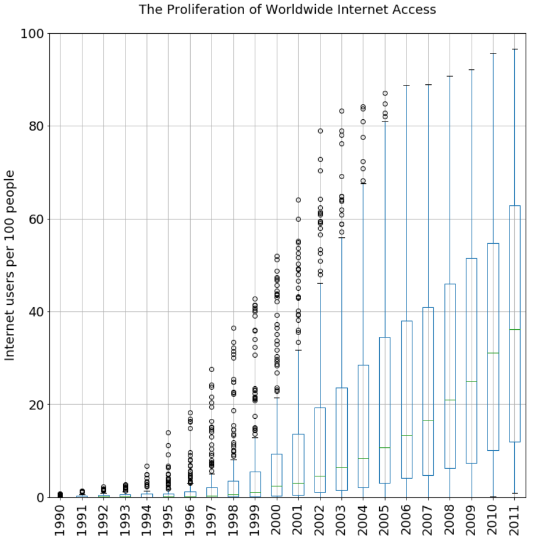
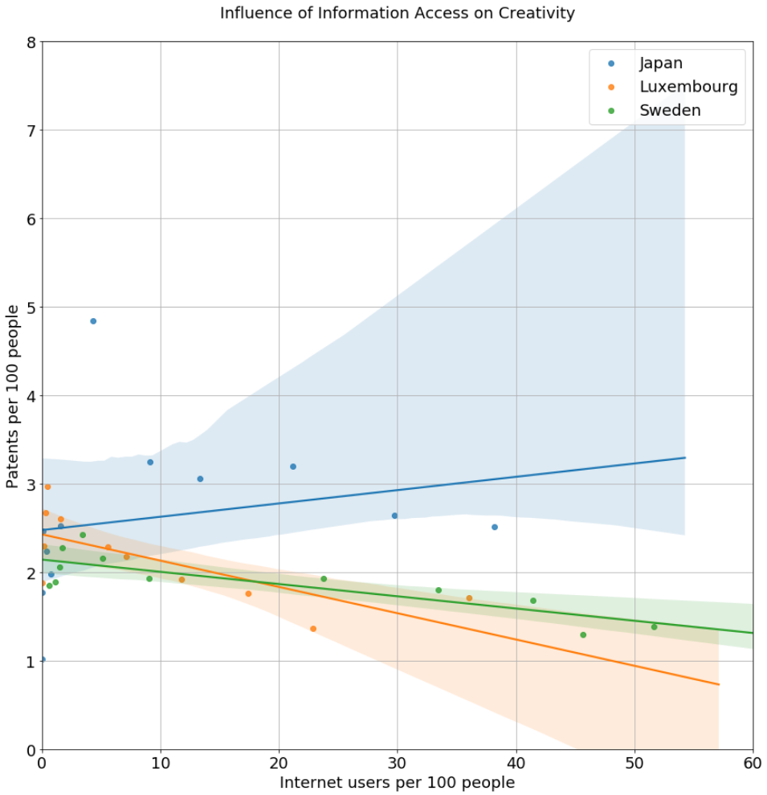

## Investigate a Dataset

Worldwide creativity trends are analyzed using the Python libraries NumPy, pandas, matplotlib, and the findings communicated in a Jupyter Notebook.

#### Skills Demonstrated

- Traverse all the steps involved in a typical data analysis process.
- Be comfortable posing questions that can be answered with a given dataset and then answering those questions.
- Know how to investigate problems in a dataset and wrangle the data into a useable format.
- Have practice communicating the results of your analysis using Jupyter Notebooks.
- Be able to use vectorized operations in NumPy and pandas to speed up data analysis code.
- Be familiar with pandas' Series and DataFrame objects, which access data more conveniently.
- Know how to use Matplotlib to produce plots showing conclusive findings.

#### 

#### 
